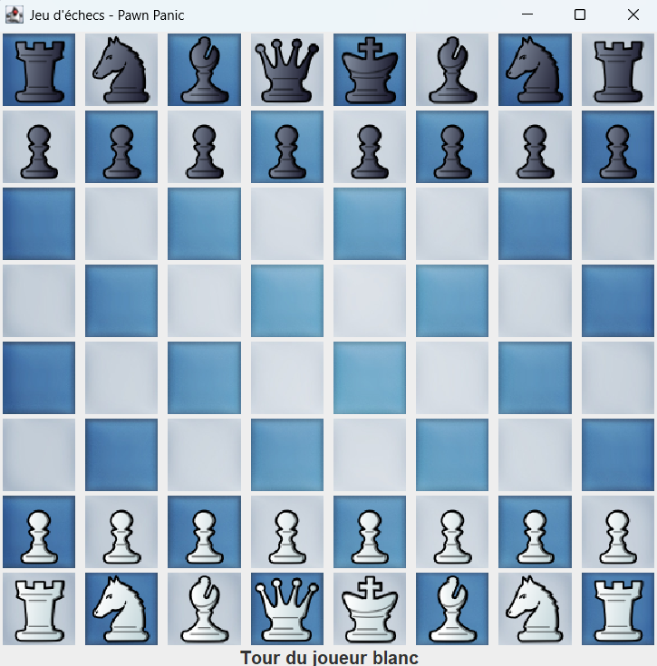

# Chess Game

## Installation

To run the Chess Game, you will need to have Java installed on your system. You can download the latest version of Java from the official website: [https://www.java.com/en/download/](https://www.java.com/en/download/).

Once you have Java installed, you can clone the repository and run the application:

git clone https://github.com/your-username/chess-game.git
cd chess-game
javac *.java
java Main

vbnet
Copy
Edit

## Screenshot

## Usage

The Chess Game is a graphical user interface (GUI) application that allows you to play a game of chess against another player. The game board is displayed on the screen, and you can make moves by clicking on the pieces and then clicking on the destination square.

The game will automatically switch between the white and black players, and will validate the legality of each move. If a move is invalid, the game will display an error message.

## API

The Chess Game is built using the following classes:

- `ChessGUI`: The main class that creates the GUI and handles user interactions.
- `ChessBoard`: Represents the chess board and handles the game logic, including piece movement and turn management.
- `Piece`: The base class for all chess pieces, with subclasses for each piece type (Pawn, Rook, Knight, Bishop, Queen, King).

The `ChessBoard` class provides the following methods:

- `getPiece(int x, int y)`: Returns the piece at the specified coordinates, or `null` if the square is empty.
- `movePiece(int startX, int startY, int endX, int endY)`: Attempts to move a piece from the start coordinates to the end coordinates, and returns `true` if the move was successful.
- `cloneBoard()`: Returns a deep copy of the current chess board state.

## Contributing

If you would like to contribute to the Chess Game project, please follow these steps:

1. Fork the repository.
2. Create a new branch for your feature or bug fix.
3. Make your changes and commit them.
4. Push your changes to your forked repository.
5. Submit a pull request to the original repository.

## License

The Chess Game is licensed under the [MIT License](LICENSE).

## Testing

The Chess Game includes unit tests for the `ChessBoard` class, which can be run using a testing framework like JUnit. To run the tests, you can use the following command:

javac -cp .:junit-4.13.2.jar:hamcrest-core-1.3.jar *.java
java -cp .:junit-4.13.2.jar:hamcrest-core-1.3.jar org.junit.runner.JUnitCore ChessBoardTest

javascript
Copy
Edit

This will compile the Java files and run the `ChessBoardTest` class, which contains the unit tests for the `ChessBoard` class.